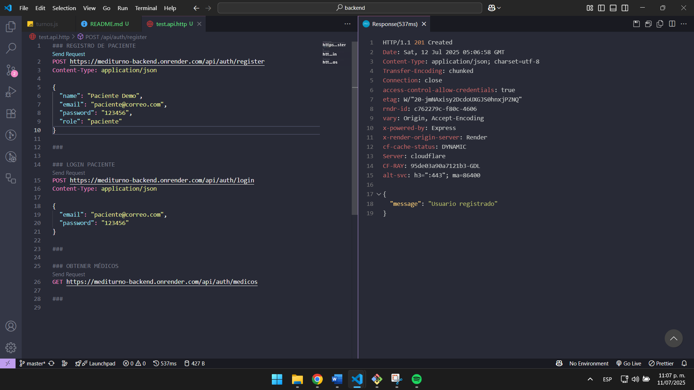
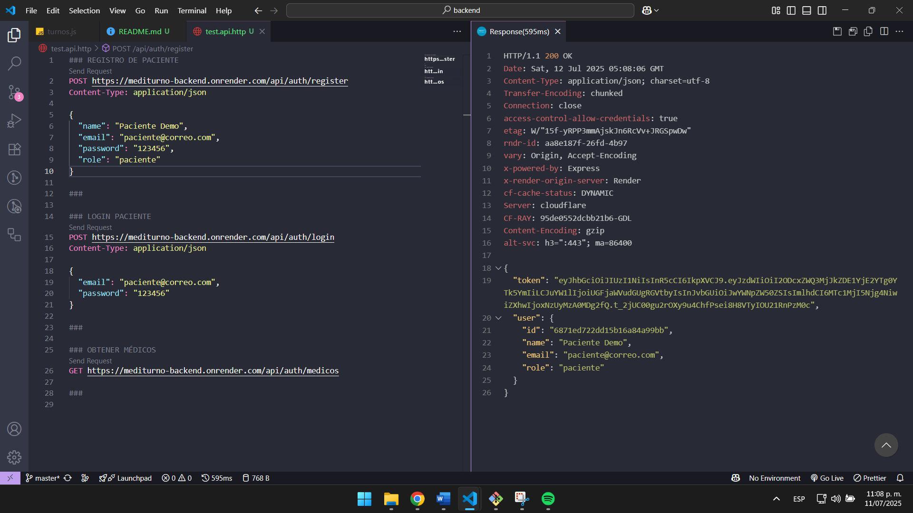
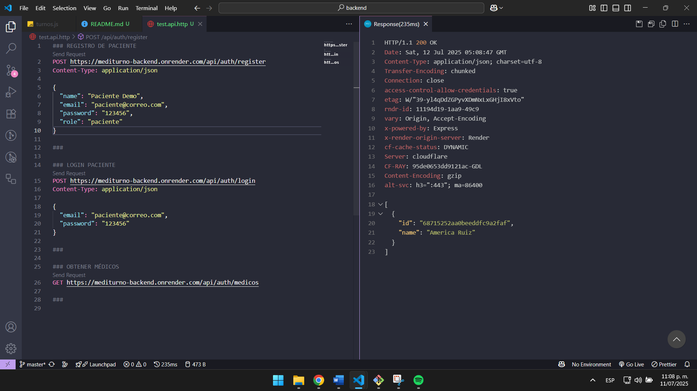

# 🩺 MediTurno - Backend

Este repositorio contiene el **backend** de MediTurno, la API REST desarrollada en **Node.js/Express** para la gestión de turnos médicos, usando **MongoDB Atlas** para la base de datos.

---

## 🚀 API en producción

* **Endpoint backend:** [https://mediturno-backend.onrender.com](https://mediturno-backend.onrender.com)
* **Repositorio frontend:** [https://github.com/JeesusA/mediturno-frontend](https://github.com/JeesusA/mediturno-frontend)

---

## 📸 Ejemplo de uso/API
**Registro de paciente para demo**

**Login de paciente recien creado**

**Obtener a los medicos**


---

## 🏗️ Estructura del proyecto

```
src/
├── config/             # Configuración de conexión MongoDB
├── middleware/         # Middlewares de autenticación JWT
├── models/             # Modelos de datos (User, Turno)
├── routes/             # Rutas de la API (auth, turnos)
└── server.js           # Archivo principal
.env.example            # Ejemplo de variables de entorno
```

---

## ⚙️ Instalación y configuración

1. **Clona el repositorio:**

   ```bash
   git clone https://github.com/tuusuario/mediturno-backend.git
   cd mediturno-backend
   ```

2. **Instala dependencias:**

   ```bash
   npm install
   ```

3. **Configura las variables de entorno:**

   * Copia `.env.example` a `.env` y edita con tus datos:

     ```
     MONGODB_URI=mongodb+srv://<usuario>:<password>@<cluster>.mongodb.net/
     DB_NAME=mediturno
     JWT_SECRET=unSecretoMuySeguro
     FRONTEND_URL=https://mediturno-frontend.vercel.app
     ```

4. **Ejecuta localmente:**

   ```bash
   npm run dev
   ```

---

## 🧩 Principales endpoints

* `POST   /api/auth/register`        → Registro de usuarios
* `POST   /api/auth/login`           → Autenticación y login
* `GET    /api/auth/medicos`         → Listado de médicos
* `POST   /api/turnos`               → Solicitar turno (solo paciente)
* `GET    /api/turnos/paciente`      → Turnos del paciente
* `GET    /api/turnos/medico`        → Turnos del médico
* `PUT    /api/turnos/:id/estado`    → Marcar turno como terminado

---

## 🛠️ Despliegue en producción

* Desplegado en [Render](https://render.com/)
* Base de datos MongoDB Atlas

---

## 👨‍💻 Tecnologías

* Node.js
* Express
* Mongoose
* JWT
* MongoDB Atlas

---

## 📄 Licencia

MIT

---
